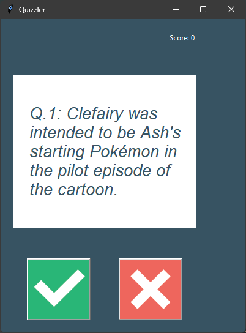

# 🧠 QuizzlerApp

A **True or False Quiz** built with **Python** and **Tkinter**.  
The questions come from data.py, and the app displays your score in real time.

## 📸 Demo


## 🚀 Features
- **True or False** questions
- Graphical interface with **Tkinter**
- Interactive answer buttons
- Instant feedback:
  - ✅ Green (correct)
  - ❌ Red (incorrect)
- Automatic score update
- Moves to the next question automatically

## 🗂 Project Structure

```QuizzlerApp/
│── images/           # UI assets (true.png, false.png, card.png, etc.)
│── data.py           # Question bank
│── main.py           # Entry point
│── question\_model.py # Question class
│── quiz\_brain.py     # Quiz logic
│── ui.py             # Tkinter interface
│── README.md         # Documentation
```


## 🛠 Tech Stack
- [Python 3.13+](https://www.python.org/)
- [Tkinter](https://docs.python.org/3/library/tkinter.html)
- [Pathlib](https://docs.python.org/3/library/pathlib.html)
- [HTML (html.unescape)](https://docs.python.org/3/library/html.html)

## ▶️ How to Run

# Clone repository
git clone https://github.com/cecilia-zica/QuizzlerApp.git
cd QuizzlerApp

# Check Python version
python --version

# Run the app
python main.py

## 📖 Learnings

* **Separation of concerns:**

  * `QuizBrain` → game logic
  * `QuizInterface` → UI
* Using Tkinter’s `after(ms, func)` for delayed feedback without freezing the UI
* Modular project structure in Python

## 📌 Next Steps

* [ ] Add external question database (e.g., Open Trivia DB API)
* [ ] Improve UI design
* [ ] Add categories and difficulty levels

## 👩‍💻 Author

Inspired by **100 Days of Code – Python** by Angela Yu.
Adapted and improved for personal study.

